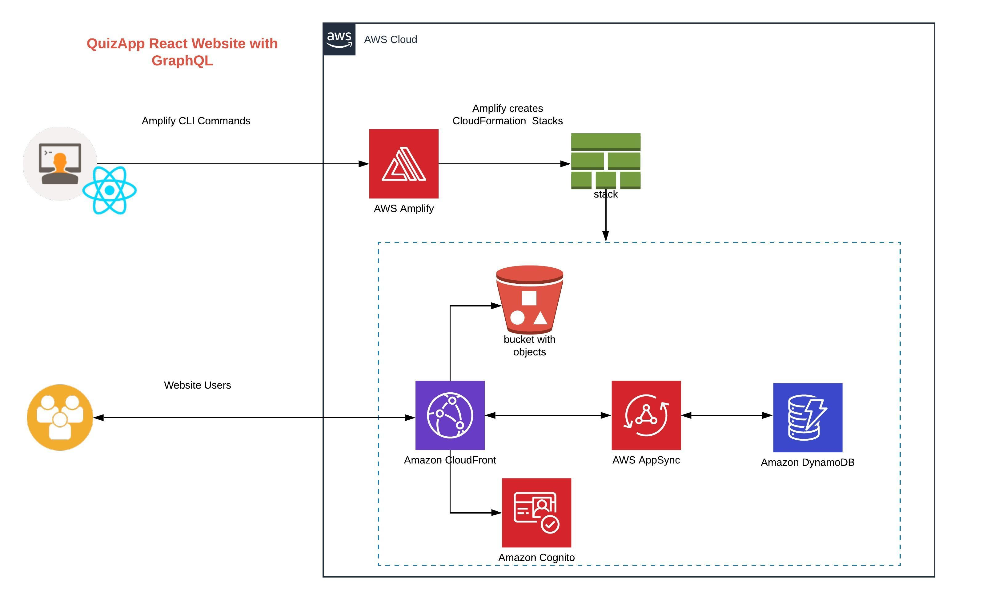

# AWS_AppSync_QuizApp
This project is created to build a quiz app based on AWS App Sync and DynamoDB

## Setup

1. Check node version: `node -v` should be more than v8.12

2. Install Amplify 
    `npm install -g @aws-amplify/cli`

3. Check Amplify
    `which amplify`

4. Launch Amplify
    `amplify`

### Frontend App

1. npx create-react-app quizbiz

2. cd quizbiz

3. npm add lodash async-retry semantic-ui-css semantic-ui-react aws-amplify aws-amplify-react

4. npm run start

or 
Simply download the git hub code and run `npm install`

### Apmplify Setup
1. cd quizbiz
2. amplify init
3. amplify status
4. amplify hosting add
5. amplify publish

#### API setup
1. amplify api add
    - please select  Do you want to configure advanced settings for the GraphQL API Yes and then in further question provide schema file name with path.
2. amplify push
3. amplify publish

#### Auth Setup
1. amplify auth add
2. amplify push

#### Refresh API to use Auth
1. amplify api update

#### Add Auth into Application
1. comment out `src/App.js` file part `export default App;`
2. Uncomment `src/App.js` file part `export default withAuthenticator(App);`

## Terraform to create AppSync and DynamoDB

1. cd appsync_terraform
2. terraform init
3. terraform plan
4. terraform apply
5. Test AppSync in Front end using test_queries.graphql

## Architecture

## Video Demo

[![Watch the video]](https://drive.google.com/file/d/1kMhj19TeeWvP7BRpd8vhqPuOVUSr4jJK/view)